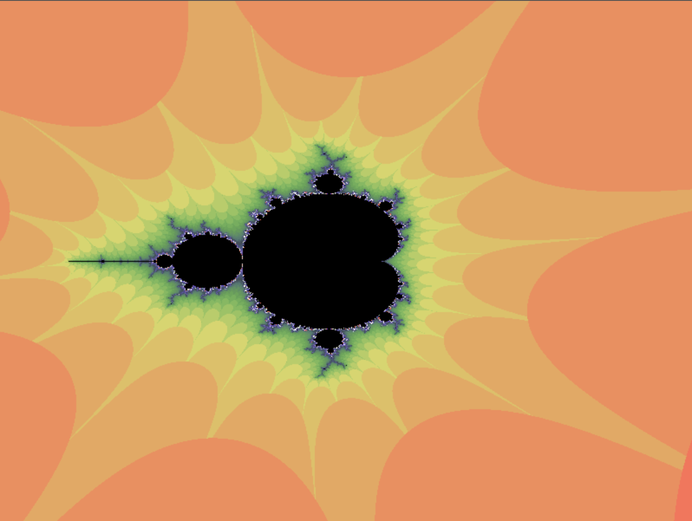
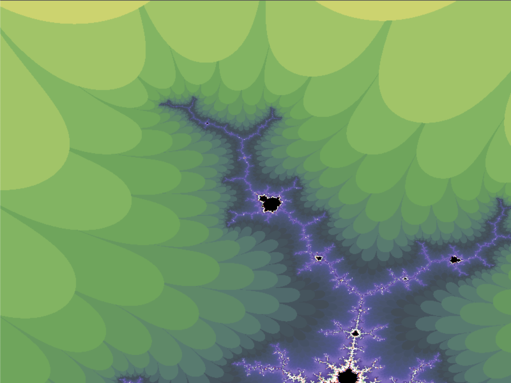

# Mandelbrot Generator
## An automated exploration of the Mandelbrot fractal
The Mandelbrot fractal is a mathematically generated psychedelic image that resembles itself across different scales. Generate your own Mandelbrot fractal with cumstomizable resolution and animate the exploration. The user interface gives you the option the explore the fractal by clicking or to start an automated exploration with defined zoom speed and resolution variables. In the future i might add different color palettes and customizeable fractal generation methods.

## Wan't to try yourself?
To do that, you can download the repo and run a local http-server pointing to the directory you saved in. I have no plan to make this available otherwise.

## Limitations
I played around with different values for resolution, max itertaions and zoom speed and the maximum possible slider values were a good balance for my Computer (Macbook Pro M1, Chrome-based Browser). If there is any need to change something, the variables are located at the very top. Also 800x600 seems to be the best balance in terms of calculation my browser can handle, but any other size works too (to do so the variables to change are w and h at the very top of sketch.js). 

## Technical details
The code is pretty straight forward and relies completely on the p5 library, the whole logic is in the draw() function and all the buttons, text, etc... is defined in the setup() function. The zooming-in proccess is implemented by serching for the brightest pixel and then zooming in on it. This proccess is repeated every frame and i had to do some color correction to make it work. I also tried implementing other, more sophisticated, methods like adaptive/grid-based sampling or dividing the image before searching, but none of them was as good for me as the searching by brightest pixel method that i went for in the first place. The "play animation" functionality is implemented by storing all calculated frames, in the form of pixel arrays, in one big array, this get's then just displayed.

### Sidenotes
The base for this code was written by ChatGPT, it was really helpful to lay out a base to work from. But sadly the longer the conversation was ongoing the more useless ChatGPT got. Also this Code relies completely on the p5 library from processing, without it this project would be way more complicated. I went this route for simplicty's sake but if i were to do something like this again, i would go a more graphic-natice route, like GLSL. But it was nice to see JS handle this graphics. I obviously know that my code is pretty messy, but as i said, JS was probably never the best option for the task and if i dump more time into fractal generation i would not opt for the browser as platform.