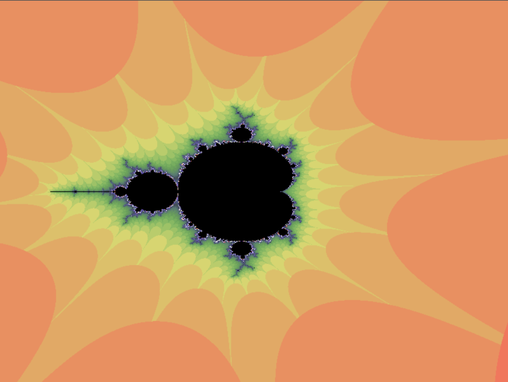

# Mandelbrot Generator
## An automated exploration of the Mandelbrot fractal
The Mandelbrot fractal is a mathematically generated psychedelic image that resembles itself across different scales. Generate your own Mandelbrot fractal with cumstomizable resolution and animate the exploration. The user interface gives you the option the explore the fractal by clicking or to start an automated exploration with defined zoom speed and resolution variables. In the future i might add different color palettes and customizeable fractal generation methods.

